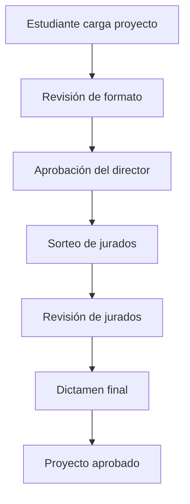

# 📁 Database Logs - SIPeT

## 📊 Sistema Integral para el Proceso y Evaluación de Tesis

Esta carpeta contiene todos los scripts de migración y documentación de la base de datos del proyecto SIPeT.

---

## 📋 Scripts de Migración Aplicados

### ✅ Ejecutados Exitosamente (2025-01-07)

| Orden | Script | Descripción | Estado |
|-------|--------|-------------|---------|
| 01 | `create_research_lines_table.sql` | Tabla de líneas de investigación | ✅ Aplicado |
| 02 | `create_thesis_projects_table.sql` | Tabla principal de proyectos de tesis | ✅ Aplicado |
| 03 | `create_project_supervisors_table.sql` | Relaciones director-tesista y jurados | ✅ Aplicado |
| 04 | `create_project_documents_table.sql` | Documentos y archivos de proyectos | ✅ Aplicado |
| 05 | `create_project_evaluations_table.sql` | Evaluaciones y seguimiento | ✅ Aplicado |
| 06 | `insert_research_lines_data.sql` | Datos iniciales de líneas de investigación | ✅ Aplicado |
| 07 | `create_tram_thesis_log_table.sql` | Sistema de seguimiento de trámites | ✅ Aplicado |

---

## 🗄️ Estructura de Base de Datos

### 📋 Tablas Principales

#### 1. **research_lines** - Líneas de Investigación
- **Propósito**: Catalogo de líneas de investigación disponibles
- **Registros**: 7 líneas para Ingeniería de Sistemas
- **Campos clave**: nombre, descripción, carrera, facultad, área_conocimiento

#### 2. **thesis_projects** - Proyectos de Tesis
- **Propósito**: Tabla principal para proyectos de tesis
- **Estados**: cargado → revisión_formato → aprobado_director → listo_sorteo → dictamen → aprobado
- **Tipos**: individual, grupal
- **Relaciones**: research_lines, users (estudiantes, supervisor)

#### 3. **project_supervisors** - Supervisores y Jurados
- **Propósito**: Gestionar relaciones entre proyectos y supervisores
- **Tipos**: director, asesor, co_director, jurado_presidente, jurado_secretario, jurado_vocal
- **Estados**: propuesto, asignado, aceptado, rechazado, activo, finalizado

#### 4. **project_documents** - Documentos
- **Propósito**: Almacenar archivos relacionados con proyectos
- **Tipos**: proyecto_inicial, proyecto_corregido, informe_turnitin, carta_aceptacion_asesor
- **Características**: Control de versiones, validación, metadatos de archivos

#### 5. **project_evaluations** - Evaluaciones
- **Propósito**: Seguimiento de evaluaciones por parte de supervisores
- **Tipos**: revision_formato, aprobacion_director, revision_jurado, dictamen_final
- **Resultados**: aprobado, aprobado_con_observaciones, rechazado, pendiente

#### 6. **tram_thesis_log** - Log de Trámites ⭐ NUEVO
- **Propósito**: Seguimiento detallado de todos los trámites y cambios de estado
- **Campos**: step_number, estado_anterior, estado_nuevo, accion, descripcion
- **Actores**: tesista, director, jurado, coordinador, administrador, sistema
- **Características**: hitos importantes, notificaciones, datos adicionales en JSON

---

## 🔄 Flujo del Sistema de Tesis

---

## 🔗 Relaciones de Base de Datos

### Tablas Core del Sistema Existente
- **users** - Usuarios del sistema (estudiantes, docentes, coordinadores, administradores)
- **administrators** - Administradores del sistema
- **user_stats** - Estadísticas de usuarios

### Nuevas Tablas de Tesis (Implementadas)
- **research_lines** ← **thesis_projects** ← **project_supervisors**
- **thesis_projects** ← **project_documents**
- **thesis_projects** ← **project_evaluations**
- **thesis_projects** ← **tram_thesis_log** ⭐ NUEVO

---

## 💾 Información de la Base de Datos

**Proveedor**: Supabase  
**Proyecto**: oydittvsdhggwfzxlnib  
**URL**: https://oydittvsdhggwfzxlnib.supabase.co  
**Esquema**: public  

---

## 📝 Notas de Implementación

### Características Implementadas
- ✅ **Triggers automáticos** para `updated_at` en todas las tablas
- ✅ **Índices optimizados** para consultas frecuentes
- ✅ **Constraints de integridad** para datos consistentes
- ✅ **Validaciones CHECK** para estados y tipos válidos
- ✅ **Cascada en eliminaciones** para mantener integridad referencial
- ✅ **Soporte para proyectos individuales y grupales**
- ✅ **Control de versiones** para documentos
- ✅ **Sistema de notificaciones** en evaluaciones

### Datos Iniciales
- **7 líneas de investigación** para Ingeniería de Sistemas
- Campos preparados para **múltiples facultades y carreras**
- **Estados de proyecto** alineados con el flujo de tesista.tsx

---

## 🔧 Compatibilidad con Componentes

### ProyTesis.tsx ✅
- Formulario de carga compatible con `thesis_projects`
- Búsqueda de compañeros integrada con `users`
- Líneas de investigación desde `research_lines`
- Subida de archivos preparada para `project_documents`

### Flujo de Estados ✅
- Estados del timeline en tesista.tsx mapeados correctamente
- Seguimiento de progreso implementado
- Evaluaciones y observaciones soportadas

---

## 📚 Próximos Pasos Sugeridos

1. ✅ **Interfaces TypeScript actualizadas** con nuevos tipos de base de datos
2. ✅ **APIs implementadas** para interactuar con las tablas de seguimiento
3. ✅ **Almacenamiento de archivos configurado** en Supabase Storage
4. **Desarrollar panel de administración** para gestión de líneas de investigación
5. **Implementar sistema de notificaciones** automáticas por email/SMS
6. **Agregar funcionalidad de directores y jurados** para cambiar estados
7. **Dashboard de coordinadores** para supervisión general

---

**Última actualización**: 2025-08-07  
**Estado**: ✅ Base de datos completamente funcional con sistema de seguimiento  
**Desarrollador**: Claude Code

---

## 🆕 NUEVO - Sistema de Seguimiento de Trámites

### **Tabla `tram_thesis_log`** ✨

**Características Principales:**
- ✅ **Log completo** de todos los cambios de estado
- ✅ **Seguimiento por pasos** (1-11) del timeline
- ✅ **Historial de actores** (quién hizo qué y cuándo)
- ✅ **Datos adicionales** en formato JSON para flexibilidad
- ✅ **Marcadores de hitos** importantes
- ✅ **Sistema de notificaciones** integrado

**Funciones Implementadas:**
- `add_thesis_log()` - Agregar nuevo log de trámite
- `get_thesis_log_history()` - Obtener historial completo
- Vista `thesis_current_status` - Estado actual por proyecto

**Integración Frontend:**
- ✅ **ProyTesis.tsx** - Crea log inicial al subir proyecto
- ✅ **tesista.tsx** - Muestra historial de trámites completo
- ✅ **UI moderna** con timeline visual y estados

### **Flujo de Datos Implementado:**

1. **Usuario sube proyecto** → Se crea registro en `thesis_projects`
2. **Sistema crea log inicial** → `tram_thesis_log` con estado 'cargado'
3. **Timeline se actualiza** → Paso 1 completado, paso 2 desbloqueado
4. **Historial visible** → Usuario ve registro completo de su proceso

**Estado: 🚀 COMPLETAMENTE FUNCIONAL**  